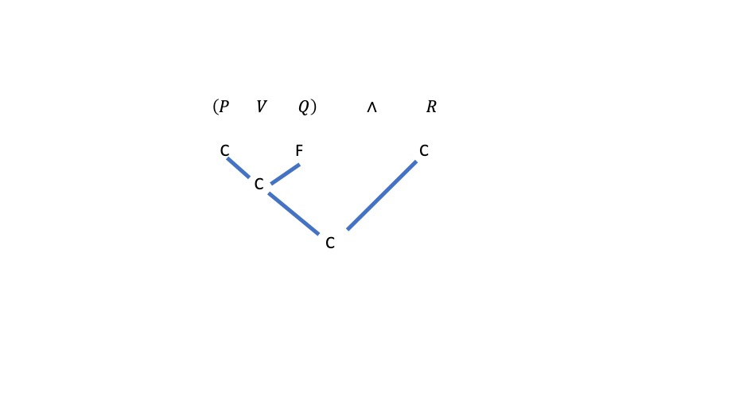
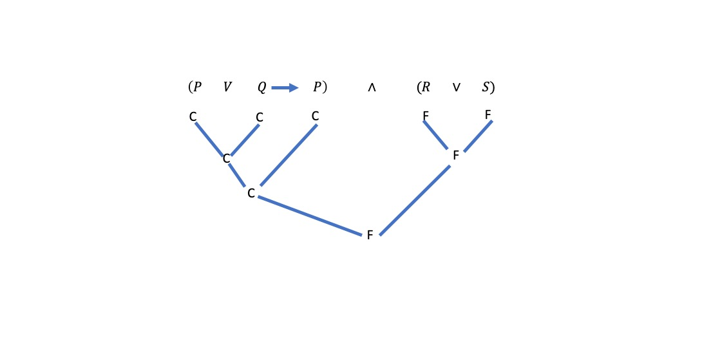
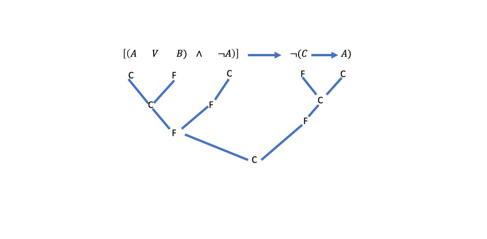

```{r}
library(texpreview)
```

# 3 Certeza y validez

## 3.1 Introducción

Se puede decir que un razonamiento es válido sólo cuando se puede sostener la afirmación indicando cada una de las reglas de inferencia empleadas para cada proposición deducida: ¿Es posible que existan inferencias proposicionales válidas sin que las reglas dadas sean suficientes para apoyarlas?

Supóngase que alguien sugiere como regla de inferencia que si se tiene la proposición 
$P \rightarrow Q$ entonces se puede deducir la proposición $\neg{P} \lor Q$. De otra forma, que si $P \rightarrow Q$ es una proposición cierta, entonces la proposición $\neg{P} \lor Q$ ha de ser siempre cierta. La inferencia es, en efecto, válida. Pero si se considera la lista de reglas de inferencia estudiadas hasta ahora, no se encuentra ninguna que permita pasar directamente de esta premisa a la conclusión.

En caso como el anterior donde las premisas son ciertas y la conclusión es falsa, indica la existencia de un razonamiento no válido **porque premisas válidas conducen únicamente a conclusiones válidas**.

En esta sección tiene como objetivo introducir un método adecuado para trabajar con inferencias proposicionales válidas.

## 3.2 Valorez de certeza y términos de enlace de certeza funcional

Se empezará con la idea de que cada proposición ha de tener un valor de certeza; cada proposición ha de ser cierta o falsa. El valor de certeza de una proposición cierta es cierto, y el valor de certeza de una proposición falsa es falso. Cada proposición atómica o molecular tiene uno de estos dos valores de certeza posibles.

Si se conocen los valores de certeza de las proposiciones atómicas y los términos de enlace dentro de proposiciones moleculares, entonces es posible dar los valores de certeza de las proposiciones moleculares. Se estudiará por separado cada término de enlace de proposiciones y se verá cuál es su comportamiento. 

**Conjunción ($\land$)**

Hay cuatro combinaciones posibles de valores de certeza para proposiciones de la forma P y Q. Recordando que la certeza de la conjunción $P \land Q$ depende de los valores de certeza de las proposiciones atómicas, se trata de hallar la combinación para las que la conjunción $P \land Q$ será una proposición cierta.

1. Si $P$ es cierta y $Q$ es cierta, entonces $P \land Q$ **es cierta**.
2. Si $P$ es cierta y $Q$ es falsa, entonces $P \land Q$ es falsa.
3. Si $P$ es falsa y $Q$ es cierta, entonces $P \land Q$ es falsa.
4. Si $P$ es falsa y $Q$ es falsa, entonces $P \land Q$ es falsa.

**Ejercicio**

**A**. Juan dice, "Mi cumpleaños es en agosto y el cumpleaños de Ana es al
mes siguiente". Nos enteramos que el cumpleaños de Juan es en agosto pero
que se ha equivocado respecto al cumpleaños de Ana, pues es en noviembre.
La proposición de Juan, ¿es cierta o falsa? ¿Puede explicar la respuesta de
acuerdo con la regla del uso de la conjunción?

**B**. Decir si $P \land Q$ es cierta (C) o falsa (F) en cada uno de los casos siguientes:

1. Si P es una proposición cierta y Q es una proposición cierta.
2. Si P es una proposición cierta pero Q es una proposición falsa.
3. Si ambas P y Q son proposiciones falsas.
4. Si ni P ni Q son proposiciones falsas.
5. Si P es una proposición falsa pero Q es una proposición cierta.


**Negación ($\neg{}$)**. La regla práctica es: *La negación de una proposición cierta es falsa y la negación de una proposición falsa es cierta*.

**Ejemplo**. 

Juan no es hermano de Luisa

Para conocer la certeza o falsedad de esta proposición se necesita sólo conocer la certeza o falsedad de la proposición.

Juan es hermano de Luisa

Si la segunda proposición es cierta, entonces la primera proposición, su negación, ha de ser falsa. Si la segunda proposición es falsa, entonces la primera proposición ha de ser cierta.

La proposición P puede ser cierta o falsa. Los valores de certeza posibles para la negación $\neg{P}$ son:

- Si $P$ es cierto, entonces $\neg{P}$ es falsa.
- Si $P$ es falsa, entonces $\neg{P}$ es verdadera.

**Ejercicio**.

**A**. Indicar cuando $P \land \neg{Q}$ es cierta (C) o falsa (F) en cada uno de los
siguientes casos:

1. Si $P$ es falsa y $Q$ es cierta.
2. Si $P$ es cierta y $Q$ es falsa.
3. Si ambas $P$ y $Q$ son ciertas.
4. Si ambas $P$ y $Q$ son falsas.
5. Si $P$ es cierta y $\neg{Q}$ es cierta.

**Disyunción ($\lor$)**. Pero al considerar la certeza o falsedad de cada disjunción
se ha de tener en cuenta que se ha utilizado el sentido incluyente de la palabra "o".
Esto significa que en cualquier disjunción, por lo menos, una de las dos proposiciones es cierta y quizá ambas. Una vez más queda claro que para conocer la certeza o falsedad de la proposición $P \lor Q$ se ha de conocer la certeza o falsedad de las proposiciones $P$ y $Q$.

Al determinar los valores de certeza de $P \lor Q$, se encuentra:

1. Si $P$ es cierta y $Q$ es cierta, entonces $P \lor Q$ **es cierta**.
2. Si $P$ es cierta y $Q$ es falsa, entonces $P \lor Q$ es **es cierta**.
3. Si $P$ es falsa y $Q$ es cierta, entonces $P \lor Q$ es **es cierta**.
4. Si $P$ es falsa y $Q$ es falsa, entonces $P \lor Q$ es falsa.


**Proposiciones condicionales**. Si se conoce la certeza o falsedad de $P$ y $Q$,
entonces también se conoce la certeza o falsedad de $P \rightarrow Q$; porque la certeza o falsedad de $P \rightarrow Q$ es función, o depende, de la certeza o falsedad del antecedente y del consecuente. 

Puesto que el valor de certeza de $P \rightarrow Q$ está determinado únicamente por
la certeza o falsedad de la sentencia P y de la sentencia Q, se pueden analizar sus valores de certeza de la manera siguiente:

1. Si $P$ es cierta y $Q$ es cierta, entonces $P \rightarrow Q$ **es cierta**.
2. Si $P$ es cierta y $Q$ es falsa, entonces $P \rightarrow Q$ es falsa.
3. Si $P$ es falsa y $Q$ es cierta, entonces $P \rightarrow Q$ es **es cierta**.
4. Si $P$ es falsa y $Q$ es falsa, entonces $P \rightarrow Q$ es **es cierta**.


**Equivalencia: Proposiciones bicondicionales**. Se han considerado también
proposiciones moleculares que contienen el término de enlace "si y sólo si".
Estas proposiciones, las bicondicionales, se denominan también equivalencias.
Un ejemplo de una equivalencia es:

- Usted puede votar si y sólo si está inscrito.

La regla práctica para equivalencias es: *Una proposición condicional es cierta si y sólo si sus dos miembros son ambos ciertos o ambos falsos*.

1. Si $P$ es cierta y $Q$ es cierta, entonces $P \leftrightarrow Q$ **es cierta**.
2. Si $P$ es cierta y $Q$ es falsa, entonces $P \leftrightarrow Q$ es falsa.
3. Si $P$ es falsa y $Q$ es cierta, entonces $P \leftrightarrow Q$ es falsa.
4. Si $P$ es falsa y $Q$ es falsa, entonces $P \leftrightarrow Q$ es **es cierta**.


## 3.3 Diagramas de valores de certeza 

Independientemente de la longitud y de lo complicada que sea una proposición molecular, se pueden hallar sus valores de certeza si se conocen los valores de certeza de sus partes.

Una forma de analizar el valor de certeza de una proposición molecular es estableciendo un diagrama. Se tiene la proposición: $(P \lor Q) \land R$ donde $P$ es una proposición cierta, $Q$ es falsa y R es cierta. El diagrama tendrá la forma

```{r pressure1, echo=FALSE, out.width = '90%'}

```

Se considera ahora el ejemplo,

$(P\land Q \rightarrow P) \land (R \lor S)$

donde P es cierta, Q es cierta, R es falsa y S es falsa. Antes de continuar
se ha de advertir que si una proposición atómica se presenta más de una vez
dentro de una proposición molecular completa, entonces ha de ser tratada
de la misma manera cada vez que se presenta.

El diagrama de este ejemplo tendrá la siguiente forma

```{r pressure2, echo=FALSE, out.width = '90%'}

```


El último ejemplo será una proposición molecular un poco más complicada:

$[(A \lor B) \land \neg{A}] \rightarrow \neg{(C \rightarrow A)}$.

En esta proposición sea A cierta, B falsa, y C falsa. El diagrama que sigue
muestra que la proposición completa, que es condicional, es una proposición
cierta.

```{r pressure3, echo=FALSE, out.width = '90%'}

```

Obsérvese la proposición que es una negación. Puesto que A es una proposición cierta, entonces $\neg{A}$ es falsa. Obsérvese también que el término de
enlace dominante es $\rightarrow$, y por tanto su enlace se dibuja el último. En el caso de la condicional, el antecedente era falso y el consecuente era cierto. La regla práctica para las condicionales indica que en este caso la condicional es una proposición cierta.


## 3.4 Conclusiones no validas

Se busca poder probar cuándo una conclusión no es consecuencia lógica y cuándo una inferencia particular **es no valida**.

Supongamos dado un conjunto de premisas, y se trata de demostrar que cierta conclusión es consecuencia lógica de estas premisas, pero no se sabe deducir la conclusión deseada. Esto no basta para suponer que la proposición no es válida o que no se deduce de las premisas. 

El razonamiento siguiente es no válido:

- Si tú eres su hijo entonces él es tu padre.
- Él es tu padre.
- Entonces, tú eres su hijo.

Decir que este razonamiento no es válido es decir que la conclusión no es
consecuencia lógica de las premisas. Al hablar de validez o no validez de las
conclusiones se hace referencia a la *forma* del razonamiento. Simbolizado, el razonamiento se presentaría en la forma

\begin{align*}
\textrm{ } & P \rightarrow Q \\
\textrm{ } & Q \\
& \cline{1-2} \\
\textrm{ } & P \\
\end{align*}

Si ésta fuera una forma válida, permitiría siempre deducir sólo
conclusiones ciertas de premisas ciertas. Por tanto, si hay algún caso en que
esta forma permite deducir una conclusión falsa de premisas que son ciertas,
entonces no puede ser válida. Para demostrar que un razonamiento no es válido se busca una interpretación de este razonamiento en el que las premisas sean proposiciones ciertas y la conclusión sea una proposición falsa.

Para demostrar que el razonamiento anterior no es válido se podría interpretar en la forma siguiente:

Sea

- P = Usted es un ciudadano de Antofagasta.
- Q = Usted es un ciudadano de Chile.

La interpretación diría:

- Si usted es un ciudadano de Antofagasta, entonces usted es un
ciudadano de Chile.
- Usted es un ciudadano de Chile.
- Por tanto, usted es un ciudadano de Antofagasta.

Hay ciertamente muchos casos en los que estas premisas son proposiciones
ciertas, pero la conclusión es falsa. Para cada ciudadano de Chile las premisas son ciertas, pero para muchos ciudadanos de Chile la conclusión es falsa. La forma del razonamiento original nos permite deducir una conclusión falsa de premisas ciertas. Por tanto, se ha demostrado que el razonamiento no es válido.

Este razonamiento que se acaba de considerar es un ejemplo de un
error corriente: el error de "afirmar el consecuente". Lo importante en esta
interpretación no era el contenido de las proposiciones, sino sus valores de certeza posibles.

**Ejemplo**.El razonamiento siguiente no es válido. Dar una asignación de certeza que demuestre su invalidez.

- Si María termina pronto, entonces se irá a casa con Rosa.
- O se irá a casa con Rosa o encontrará a Antonia.
- María termina pronto.
- Por tanto, no encontrará a Antonia


Simbolizamos las proposiciones atomicas

P = María termina pronto.

Q = se irá a casa con Rosa.

S = encontrará a Antonia.

\begin{align*}
\textrm{ (1) } & P \rightarrow Q & P && C \\
\textrm{ (2) } & Q \lor S & P && C \\
\textrm{ (3) } & P  & P && C \\
\textrm{ (4) } & \neg{S}  & Conclusión && F \\
\end{align*}


**Ejemplo**.El razonamiento siguiente no es válido. Dar una asignación de certeza que demuestre su invalidez.

- Jorge es elegido si y sólo si la votación es numerosa.
- La votación es numerosa.
- O Jorge es elegido o Juan no será nombrado.

Simbolizamos las proposiciones atomicas

P = Jorge es elegido.

Q = la votación es numerosa.

S = Juan será nombrado.


\begin{align*}
\textrm{ (1) } & P \leftrightarrow Q & P && C \\
\textrm{ (2) } & Q  & P && C \\
\textrm{ (3) } & P \lor (\neg{S}) & P && C \\
\textrm{ (4) } & S  & Conclusión && F \\
\end{align*}


