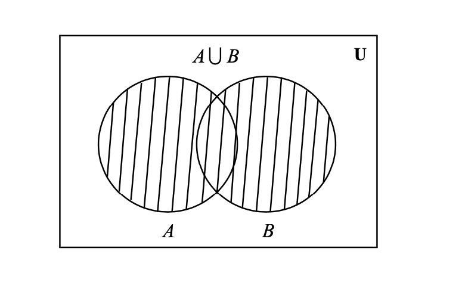
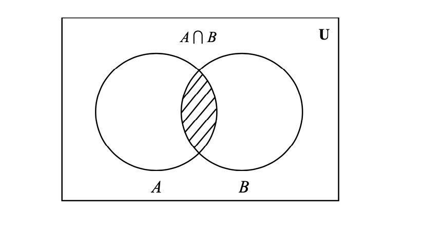
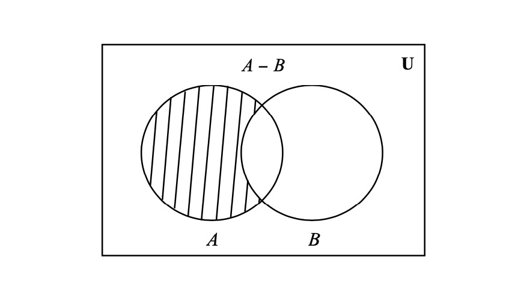

# 4 Teoría de conjuntos

## 4.1 Conjunto y subconjuntos

Un conjunto es cualquier colección of cosas u objectos. Una lista de supermercado es un conjunto de cosas que usted desea comprar cuando va a un super mercado. EL conjunto es una colección de objetos, llamados **elementos**, y que tienen la propiedad que algún objeto, es un elemento del conjunto.

\vspace{5 mm}

**Definiciones**. 

\vspace{5 mm}

**Igualdad de conjuntos**

A es un **igual** a B si A y B contienen exactamente los mismos elementos. Escribimos $A = B$ y mostramos que $A = B$ siempre que $A \subseteq B$ y $B \subseteq A$. La definición anterior puede escribirse de la siguiente manera:

$A = B \iff (\forall x)$ $(x \in A \iff x \in B)$.
\vspace{5 mm}

**Conjuntos diferentes**

Dos conjuntos son diferentes cuando no son iguales. Eso quiere decir que basta que no se cumple alguna de la condiciones establecidas en la definición de igualdad, para que dos conjuntos sean diferentes. Es decir:

$A \ne B \iff \exists a \in A$; $a \notin B$ o $\exists b \in B$; $b \notin A$.

\vspace{5 mm}

**Conjunto vacío**
Denotamos por conjunto vacío aquel conjunto que no posee elemento alguno. Expresamos que un conjunto A es vacío mediante el símbolo $A = \varnothing$.
\vspace{5 mm}

**Subconjunto**

Supóngase que A y B son conjuntos. Entonces A es llamado un subconjunto de B, si cada elemento $a \in A$ y también se tiene que $a \in B$. También puede indicarse que el conjunto A **está incluido** (o contenido) en el conjunto B. $A \subseteq B \iff x \in A \implies x \in B$.

Esta definición se refiere al “sentido amplio” de la inclusión, es decir, contempla la posibilidad de que B sea A. En la definición siguiente, nos referiremos a la inclusión “en sentido estricto”.
 
\vspace{5 mm}

**Subconjunto propio**

Decimos que A está **estrictamente incluido** en B (o que A **es parte propia** de B) si A está incluido en B pero es diferente de B. $A \subset B \iff A \subseteq B$ y $A \neq B$.

Lo anterior implica que: $A \subset B \iff \forall x, x \in A \implies x \in B$ y $\exists x, x \in A / x \notin B$.

**Ejemplos**.

Sea $A = \{ 1,2,3 \}$, $\{ 1 \} \subseteq A$, $\{2,3 \} \subseteq A$. $A \subseteq A$.

$\mathbb{N} \subseteq \mathbb{Z} \subseteq \mathbb{Q} \subseteq \mathbb{R} \subseteq \mathbb{C}$.
\vspace{5 mm}

**Propiedad**

Sea A y B conjuntos. Tenemos que:

$A = B \iff A \subseteq B \land B \subseteq A$.

**Demostración**: Tenemos la siguiente identidad lógica 

$(\forall x)(p(x) \land p(x)) \iff [(\forall x) p(x) \land (\forall x) p(x)]$.

\begin{equation}
\begin{split}
A = B & \iff (\forall x) (x \in A \iff x \in B) \\
A = B & \iff (\forall x) [(x \in A \implies x \in B) \land (x \in B \implies x \in A)] \\
A = B & \iff (\forall x) (x \in A \implies x \in B) \land (\forall x) (x \in B \implies x \in A) \\
A = B & \iff A \subseteq B \land B \subseteq A \nonumber
\end{split}
\end{equation}

**Propiedades de la inclusión y la igualdad**: Sea A,B,C conjuntos arbitrarios, tenemos

1. Propiedad reflexiva: todo conjunto es parte de sí mismo. $A = A$
2. $A = B \iff B = A$
3. $(A = B \land  B = C) \implies A =C$.
4. $A \subseteq A$.
5. $(A \subseteq B \land B \subseteq A) \implies A = B$.
6. $(A \subseteq B \land B \subseteq C) \implies A \subseteq C$.
7. $\varnothing \subseteq A$.

**Demostración propiedad 6**:

**Hipótesis**: $A \subseteq B$ y $B \subseteq C$

**Tesis**: $A \subseteq C$

Por hipótesis se $A \subseteq B$, entonces, por definición: $(\forall x) (x \in A \implies x \in B)$.

También por hipótesis $B \subseteq C$, y por definición: $(\forall x) (x \in B \implies x \in C)$.

En consecuencia, podemos afirmar: $\forall (x) (x \in A \implies x \in C)$ lo que, por definición es lo mismo que la tesis que queremos demostrar: $A \subseteq C$

**El resto de demostraciones quedan a cargo del estudiant**.
\vspace{5 mm}

**Paréntesis importante**

Existen cuatro formas de enunciar a los conjuntos

1. Por extensión o enumeración: los elementos son encerrados entre llaves y separados por comas. Se describe el conjunto listando todos sus elementos entre llaves.

2. Por compresión: los elementos se determinan a través de una condición que establece entre llaves.

$A = \{x \in \mathbb{N} | x^{2} \} = \{1,4,9,..., \}$ significa que el conjunto A es el conjunto de todos los números naturales elevados a la potencia 2.

3. Diagrama de Venn: son regiones cerradas que sirven para visualizar el contenido de un conjunto o las relaciones entre conjuntos.

4. Descripción verbal: es un enunciado que describe las característica que es común para los elementos.
\vspace{5 mm}

## 4.2 Álgebra de conjuntos

**Unión de conjuntos**

Llamaremos **unión** de dos conjuntos A y B al conjunto formado por todos los elementos que pertenecen a A o pertenecen a B.

$A \cup B = \{x| x \in A \quad \text{ó} \quad x \in B \} = \{x| x \in A \lor x \in B \}$.

```{r pressure2, echo=FALSE, out.width = '90%'}

```

**Intersección de conjuntos**

Llamaremos **intersección** de dos conjuntos A y B al conjunto formado por todos los elementos que pertenecen a A y a B.

$A \cap B = \{x| x \in A \quad \text{y} \quad x \in B \} = \{x| x \in A \land x \in B \}$.

```{r pressure3, echo=FALSE, out.width = '90%'}

```

\vspace{5 mm}

**Propiedades de la unión e intersección de conjuntos**

Sean A, B, C conjuntos, se tiene:

1. Conmutación
  a) $A \cup B = B \cup A$
  b) $A \cap B = B \cap A$
  
2. Asociativa
  a) $A \cup (B \cup C) = (A \cup B) \cup C)$
  b) $A \cap (B \cup C) = (A \cap B) \cup C)$
  
3. Distributiva 
  a) $A \cup (B \cap C) = (A \cup B) \cap (A \cup C)$
  b) $A \cap (B \cup C) = (A \cap B) \cup (A \cap C)$
  
\vspace{5 mm}

**Algunos teoremas y propiedades de importancia**

**Teorema 1**: Un conjunto A está contenido en otro conjunto B, sí y sólo si la unión de A y B es B

$A \subseteq B \iff A \cup B = B$

**Demostración**

Hipótesis: $A \subseteq B$

Tesis: $A \cup B = B$

Partimos del primer miembro de la tesis, aplicándole la definición de la unión:

$A \cup B = \{x| x \in A \lor x \in B \}$.

Aplicando la definición de inclusión, como por hipótesis $A \subseteq B$, entonces se cumple que $\forall x$,$x \in A \implies x \in B$

Entonces, sustituyendo, nos queda

\begin{equation}
\begin{split}
A \cup B & = \{x| x \in B \lor x \in B \} \\
A \cup B & = \{x| x \in B \} \\
A \cup B & = B \nonumber
\end{split}
\end{equation}

**Propiedad 1**

La intersección de cualquier conjunto con el conjunto vacío, es el conjunto vacío.

$A \cup \varnothing = \varnothing$.

**Teorema 2**: Si un conjunto está contenido en otros dos, está contenido en la intersección de ambos.

Hipótesis: $C \subseteq A$ y $C \subseteq B$

Tesis: $C \subseteq (A \cap B)$

Demostración: Por hipótesis, y aplicando la definición de inclusión, se cumple a la vez:

$\forall x, x \in C \implies x \in A$ (por que $C \subseteq A$)

$\forall x, x \in C \implies x \in B$ (por que $C \subseteq B$)

Entonces, todos los elementos de C pertenecen a A y a B:

$\forall x, x \in C \implies x \in A \land x \in B$ 

O sea:

$\forall x, x \in C \implies x \in (A \cap B)$ 

Y, por definición de inclusión:

$C \subseteq (A \cap B)$.

**Teorema 3**: Es condición necesaria y suficiente para que un conjunto A esté incluido en otro conjunto B, que la intersección de A y B sea A.

$A \cap B = A \iff A \subseteq B$.

**Definición**: Decimos que A y B son **conjuntos disjuntos**, si su intersección es vacía, es decir, si

$A \cap B = \varnothing$.

\vspace{5 mm}

**Conjunto universo**

Asumiremos la existencia de un universo (conjunto de referencia) **U** en el que viven todos los elementos con los cuales se va a trabajar. Es decir, **U** es tal que la proposición $a \in U$ es siempre verdadera.

**Colorario**

Sean A un conjunto y sea **U** el conjunto universo, se tiene:

1. $A \cup A =A$
2. $A \cap A =A$
3. $A \cup \varnothing = A$
4. $A \cap \varnothing = \varnothing$
5. $A \cup U = U$
6. $A \cap U = A$

Demostración $A \cup A =A$.

\begin{equation}
\begin{split}
A \cup A & = \{x| x \in A \lor x \in A \} = \{x| x \in A \}  \\
A \cup A & = A \nonumber
\end{split}
\end{equation}

\vspace{5 mm}

**Diferencia de conjuntos**

La diferencia de los conjunto A y B (en ese orden) es el conjunto de los elementos que pertenecen a A y no pertenecen a B y se denota como $A-B$. Esto es:

$A - B = \{x | x \in A \quad \text{y} \quad x \notin B \}$

Gráficamente

```{r pressur, echo=FALSE, out.width = '90%'}

```


\vspace{5 mm}

**Complemento de un conjunto**

Llamaremos **complemento** de un conjunto A respecto de un conjunto de referencia $\Omega$, al conjunto de todos los elementos de $\Omega$ que no pertenecen a A. Es decir,

$A^{c} = \Omega-A$

Como ya vimos en la definición de diferencia, esto mismo se podría escribir 

$A^{c} = \{x | x \in \Omega \land x \notin A\}$

**Propiedades del complemento de un conjunto**

1. $A^{c} \cap A = \varnothing$
2. $(A^{c})^{c} = A$
3. $(\varnothing)^{c} = \Omega$
4. $(\Omega)^{c} = \varnothing$
5. $A \cup A^{c} = \Omega$

\vspace{5 mm}

**Leyes de Morgan**

**Primera ley de Morgan**: El complemento de la unión es la intersección de los complementos. Es decir, $(A \cup B)^{c} = A^{c} \cap B^{c}$.

**Demostración**
Hipótesis: A y B son conjuntos de un cierto referencial $\Omega$

Tesis: $(A \cup B)^{c} = A^{c} \cap B^{c}$

Seguiremos el procedimiento empleado para demostrar que dos conjuntos son iguales (es decir, que cada uno de ellos está contenido en el otro).

Primero, 

\begin{equation}
\begin{split}
\forall x, x \in (A \cup B)^{c} & \implies x \notin (A \cup B) \\
& \implies x \notin A \land x \notin B \\
& \implies x \in A^{c} \land x \in B^{c} \\
& \implies x \in A^{c} \cap B^{c} \nonumber
\end{split}
\end{equation}

Entonces, si $\forall x, x \in (A \cup B)^{c} \implies x \in A^{c} \cap B^{c}$, llegamos a:

\begin{equation}
\begin{split}
(A \cup B)^{c} \subseteq A^{c} \cap B^{c}
\end{split}
\end{equation}

Ahora, razonaremos en el sentido inverso:

$\forall x, x \in A^{c} \cap B^{c} \implies x \in A^{c} \land x \in B^{c}$

Como $x \in A^{c} \implies  x \notin A^{c}$, y esto puede implicar dos alternativas: $x \in (B-A)$ o $x \notin B$.

La primera es falsa, porque ya vimos que $x \notin B$ (por pertenecer $B^{c}$). Así que se cumple, a la vez:

$x \notin A \land x \notin B$

Entonces podemos asegurar que

$\forall x, x \in A^{c} \cap B^{c} \implies x \notin (A \cup B)$

o, lo que es lo mismo, 

$\forall x, x \in A^{c} \cap B^{c} \implies x \in (A \cup B)^{c}$

lo que nos lleva a:

\begin{equation}
\begin{split}
A^{c} \cap B^{c} \subseteq (A \cup B)^{c} 
\end{split}
\end{equation}

Y la verificación simultánea de las inclusiones (1) y (2) nos permiten afirmar que

$(A \cup B)^{c} = A^{c} \cap B^{c}$

\vspace{5 mm}

**Segunda ley de Morgan**: El complemento de la intersección es la unión de los complementos. Es decir, $(A \cap B)^{c} = A^{c} \cup B^{c}$.


